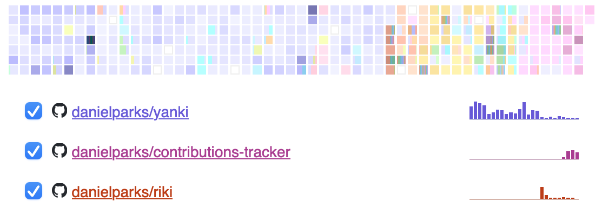

# Contributions graph

Displays a graph of the logged in user’s GitHub contributions. [Demo.]

[][Demo.]

If the request is made to the frontend base URL, it will show the contributions
for the user currently logged into GitHub. If there is a username after the base
URL, it will show the contributions for that GitHub user.

## Configuration

See [.env.example] for environment variables. You will need a GitHub client ID
and secret from https://github.com/settings/developers. The frontend URL can be
set with `$VITE_FRONTEND_URL`.

The backend should be proxied through the frontend URL at `/api`, e.g. a request
to `http://frontend/api/health` should be proxied to
`http://backend/api/health`.

## Stack

This is a TypeScript and React app with a simple Rust backend built on
[Dropshot]. Dropshot provides automatic OpenAPI support, which enables
compile-time type checking of calls across the API boundary.

## To do

- [ ] Add data source to backend so selected users’s contributions can be
      displayed to visitors without logging into GitHub.
  - Possibly use <https://github.com/graphql-rust/graphql-client>
- [ ] Add demo to <https://demon.horse/portfolio/>.
- [ ] Automated testing.
- [ ] Load information about local repositories in backend.

### Likely incompatible

- **Systemd socket activation.** Dropshot takes a `SocketAddr` as configuration
  then binds a `TcpListener`. In order to use [systemd socket activation], e.g.
  with [systemd_socket], we need to pass Dropshot an already bound
  `TcpListener`, or some sort of generic that supports
  `systemd_socket::SocketAddr`. This would require changes to Dropshot.

## License

Unless otherwise noted, this project is dual-licensed under the Apache 2 and MIT
licenses. You may choose to use either.

- [Apache License, Version 2.0](LICENSE-APACHE)
- [MIT license](LICENSE-MIT)

### Contributions

Unless you explicitly state otherwise, any contribution you submit as defined in
the Apache 2.0 license shall be dual licensed as above, without any additional
terms or conditions.

[Demo.]: https://demon.horse/portfolio/contributions-tracker/
[.env.example]: .env.example
[Dropshot]: https://docs.rs/dropshot/latest/dropshot/
[systemd socket activation]: https://www.freedesktop.org/software/systemd/man/latest/sd_listen_fds.html
[systemd_socket]: https://docs.rs/systemd_socket/latest/systemd_socket/
